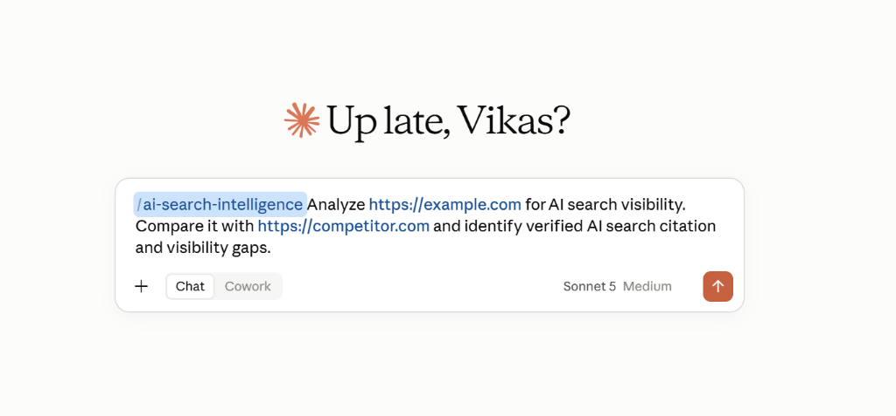

# Claude SEO Skills Suite

A production-grade collection of **8 specialized SEO & AI Search Skills** crafted for **Anthropic Claude** (Claude.ai and Claude Desktop).

Transform Claude into an elite technical SEO auditor, AI search visibility strategist, Google Business Profile specialist, structured data engineer, and conversion-focused content architect.

> **Note:** Each folder in this repository is a separate SEO skill. Install only the skills you want to use.

---

## Included Skills

| Skill Name | Directory | Core Capabilities |
| :--- | :--- | :--- |
| **AI Search Intelligence** | [`ai-search-intelligence/`](./ai-search-intelligence) | Evaluates AI Overview, Perplexity, Claude & ChatGPT Search visibility, citation gaps & AEO/GEO strategy. |
| **Google Business Profile Optimizer** | [`google-business-profile-optimizer/`](./google-business-profile-optimizer) | Local 3-Pack ranking signals, GBP audits, category mapping, review strategy & prominence scoring. |
| **SEO Content Engine** | [`seo-content-engine/`](./seo-content-engine) | People-first content creation, E-E-A-T outlines, SERP gap analysis, and content brief generation. |
| **SEO Intelligence & Opportunity** | [`seo-intelligence/`](./seo-intelligence) | Root-cause traffic drop analysis, GSC/GA4 opportunity finding, and prioritized organic growth roadmaps. |
| **SEO Performance Monitor** | [`seo-performance-monitor/`](./seo-performance-monitor) | Anomaly detection, CTR decay analysis, brand vs. non-brand tracking, and campaign ROI reporting. |
| **Structured Data & Schema Engine** | [`structured-data-schema-engine/`](./structured-data-schema-engine) | Validated JSON-LD schema generation (LocalBusiness, Medical, FAQ, Article, Organization) with Google Rich Result compliance. |
| **Technical & On-Page SEO** | [`technical-onpage-seo/`](./technical-onpage-seo) | Crawlability, indexation, canonicals, robots.txt, sitemaps, internal linking structure & Core Web Vitals remediation. |
| **User Intent & Content Auditor** | [`user-intent-content-auditor/`](./user-intent-content-auditor) | Search intent fulfillment scoring, thin/generic content auditing, and conversion pathway optimization. |

---

## Installation Guide

Follow these steps to install any SEO skill into your Claude account:

1. **Open this GitHub repository** in your browser.
2. Click the **Code** button at the top right, select **Download ZIP**, and extract the ZIP file on your computer.
3. **Open the extracted folder** on your computer.
4. **Choose the SEO skill** you want to install (e.g., `seo-intelligence`, `ai-search-intelligence`, etc.).
5. Each SEO skill is stored in its own folder and contains a `SKILL.md` file.
6. You can install a skill using either of these two ways:
   - **Option A (Direct File)**: Upload the individual `SKILL.md` file directly, **OR**
   - **Option B (ZIP Package)**: ZIP the individual skill folder and upload the ZIP.
7. **Open Claude** (on [claude.ai](https://claude.ai) or the Claude Desktop app).
8. Go to:
   **Settings** → **Customize** → **Skills** *(or click **Customize** → **Skills** in the sidebar)*.
9. Click **Upload a skill** *(or click **+** / **Add** → **Upload a skill**)*.
10. **Select the `SKILL.md` file or the ZIP package** for your chosen skill.
11. Claude performs a security scan when the skill is saved.
12. Click **Save** and make sure the skill is **enabled**.
13. **Repeat** for any other SEO skills you want to install.

---

### Recommended ZIP Structure (Optional)

If you prefer uploading skills as ZIP archives, package the skill folder like this:

```text
seo-intelligence.zip
└── seo-intelligence/
    └── SKILL.md
```

*(Note: ZIP packaging is optional. Uploading the standalone `SKILL.md` file directly is supported.)*

---

> **Note:** Claude's interface and menu names may change over time. Follow the labels shown in your current Claude version.
> 
> **Official Documentation:** For additional information on using skills in Claude, visit [Anthropic Support: Use skills in Claude](https://support.claude.com/en/articles/12512180-use-skills-in-claude).

---

## How to Use the Skills

After installing and enabling a skill:

1. Open a new chat in Claude.
2. In the message box, type `/` to open the available skills/commands.
3. Select or type the name of the SEO skill you installed.
4. The skill can be invoked using its skill name, for example:

`/ai-search-intelligence`

5. After selecting the skill, describe what you want Claude to analyze or accomplish.
6. Provide the required URL, data, files, competitor URLs, GSC/GA4 exports, HTML, keywords, or other information needed for the specific task.
7. Send the message and let the skill perform the appropriate SEO workflow.

### Example:

```text
/ai-search-intelligence

Analyze https://example.com for AI search visibility.
Compare it with https://competitor.com and identify verified AI search citation and visibility gaps.
```



---

## Skill Quick Prompts & Usage Examples

### 1. AI Search Intelligence
```text
Analyze my website [https://example.com] for AI search visibility against our competitor [https://competitor.com]. Which queries are they being cited for in AI Overviews and Perplexity that we are missing?
```

### 2. Google Business Profile Optimizer
```text
Audit our Google Business Profile for [Business Name] located in [City, State]. We offer [List of Services]. Provide a prioritized local 3-pack optimization strategy focused on relevance, distance, and prominence.
```

### 3. SEO Content Engine
```text
Create an in-depth content brief and outline targeting 'best crm for real estate agents'. Optimize for search intent, E-E-A-T credibility, and featured snippet eligibility.
```

### 4. SEO Intelligence & Opportunity Analyst
```text
Here is our Google Search Console export and top underperforming URLs: [paste data]. Conduct a diagnostic analysis to identify why traffic declined and give me a prioritized fix roadmap.
```

### 5. SEO Performance Monitor
```text
Review this GSC search performance dataset: [paste metrics]. Detect CTR decay anomalies, identify high-impression/low-click opportunities, and generate an executive performance report.
```

### 6. Structured Data & Schema Engine
```text
Generate verified JSON-LD structured data for this page: [paste URL or content]. Include LocalBusiness, WebPage, and FAQPage schemas strictly based on verifiable on-page facts.
```

### 7. Technical & On-Page SEO Remediation
```text
Audit this page HTML and robots/canonical setup: [paste code]. Flag crawlability issues, indexation blockers, canonical discrepancies, and internal linking improvements.
```

### 8. User Intent & Content Auditor
```text
Audit our article targeting 'how to choose dental insurance'. Does our content genuinely fulfill commercial search intent compared to top SERP competitors, or is it generic?
```

---

## Repository Directory Structure

```text
claude-seo-skills/
├── .gitignore
├── LICENSE
├── README.md
├── assets/
│   └── claude-skill-usage-example.png
├── ai-search-intelligence/
│   └── SKILL.md
├── google-business-profile-optimizer/
│   └── SKILL.md
├── seo-content-engine/
│   └── SKILL.md
├── seo-intelligence/
│   └── SKILL.md
├── seo-performance-monitor/
│   └── SKILL.md
├── structured-data-schema-engine/
│   └── SKILL.md
├── technical-onpage-seo/
│   └── SKILL.md
└── user-intent-content-auditor/
    └── SKILL.md
```

---

## Contributing

Contributions, additional SEO skills, and optimizations are welcome! Feel free to open an issue or submit a pull request.

---

## License

This repository is open-source and available under the [MIT License](./LICENSE).
